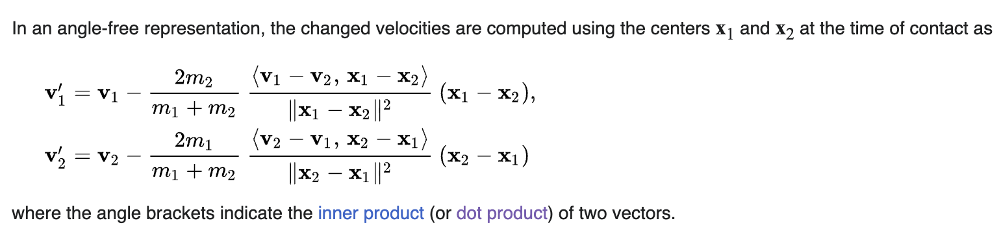

First reference: https://www.gorillasun.de/blog/an-algorithm-for-particle-systems-with-collisions/

He is not using the masses to calculate the impulse, as mentioned in the post's code block (it's different from the actual P5 code).

We shouldn't use the particle's masses for the repulsion, but their radix(?).

Improvements for the particle version with grid lookup (from https://www.gorillasun.de/blog/particle-system-optimization-grid-lookup-spatial-hashing/):
* We only need to check for collision with the canvas boundaries if the particle is in one of the grid cells located at the border of the grid.
* [already implemented] We also only need to update a particle's grid cell if it's new position falls into a new grid cell.

https://en.wikipedia.org/wiki/Elastic_collision



bola pequena às vezes orbita a grande

## COISAS A RESOLVER NA FRENTE

* Usar Bézier em vez de linhas? `quadraticCurveTo(cpx, cpy, x, y)`

`(cpx, cpy)` poderiam ser encontrados usando `[ (pa - pcenter) + (pb - pcenter) ] * c`, onde `c > 1/2` (`c = 1/2` posicionaria o ponto de controle no ponto médio dos dois pontos). Fazer interativo.

* colliders maiores que os pontos, para evitar penetração

## 2024.03.20

Particle system seems to be working. Going to try implementing the spring-mass system.

Worked. But not the circular structures.

> It kind of blows my mind that with relatively little such an interesting system emerges. The beauty of emergence: the mesh doesn't really know that it exists, it's simply the particles and springs working in tandem to create this intricate and dynamic structure.
(https://www.gorillasun.de/blog/spring-physics-and-connecting-particles-with-springs/)

Refatorar tudo.

## 2024.03.29

Seguindo agora o Makyta

Gauss formula para área de polígono:
https://www.thecivilengineer.org/education/professional-examinations-preparation/calculation-examples/calculation-example-three-point-resection

Melhor aqui (Shoelace formula): https://en.wikipedia.org/wiki/Shoelace_formula

Verlet integration: 
https://en.wikipedia.org/wiki/Verlet_integration

Leapfrog integration
https://en.wikipedia.org/wiki/Leapfrog_integration

Velocity Verlet

Pressure factor can be used to deflate / inflate the blobs

## 2024.03.30, madrugada

it works! for one blob, no collisions, though.

Check wall collisions

## 2024.04.04

Millington, Chapter 7. Collision resolution.

## 2024.04.09

Back to work.

Trying to build the grid lookup for the spatial hashing.

Playing with some of the parameters, those will be fundamental to achieve the visual effect we're aiming at.

For lower time-steps, we need lower (meaning, stronger) velocity damping to help stabilize the system. Time steps of 50 seem to work well.

## 2024.04.10

Higher stiffness make the blobs blobbier when under contact.

Gas constant and stiffness constant impact in the final blob size compared to its reference circle.

## 2024.04.11

Building the collision system. Based on Millington, chapter 7. Thinking if I need to iterate over all particles or over all cells, and whether that makes any difference.

Collisions with rods / springs? Not on this version.

Smaller radius seem more unstable for lower time steps.

Parametrizar particle radius.

No collision detection, ignorar as partículas adjacentes. Talvez adicionar índice às partículas.

Experimentar com mais springs também.

Relação time_step x velocity damping. Smaller blobs seem more instable, but increasing the time step makes them stabilize, just like reducing the velocity damping factor (thus increasing the damping) would.

Calcula theta de acordo com R do blob e r das partículas. E depois recalcula o theta para ficar perfeito.

Time_step 70 parece funcionar bem.

## 2024.04.12

Ajustes na detecção de colisões, havia um erro no código que ignorava os vizinhos imediatos. Acrescentei botão para controlar o display dos colliders.

Agora vamos a implementar a resolução de colisões.

Funcionou!

Como evitar emaranhados?

Melhorar a história de colorir os colliders.

Larger colliders would avoid the problem of particles traversing each other, or traversing the boundaries...

"In an essence, yes. But there are some tricks that happen during the collision detection, like offsetting the colliders based on the surface normals and some other factors." (https://x.com/JuhaniHalkomaki/status/1727620541316534351)

"alright, I thought it was based of a paper which I saw ages ago 🙃https://panoramx.ift.uni.wroc.pl/~maq/soft2d/howtosoftbody.pdf"
https://x.com/banterless_ai/status/1727729376106553525

Inspirations:
First, Daniel:
https://x.com/shiffman/status/1638561972928106498
then:
https://x.com/JuhaniHalkomaki/status/1629184126837305347
and then:
https://x.com/JuhaniHalkomaki/status/1727409502327300435
and then:
https://x.com/JuhaniHalkomaki/status/1624761948402319360

Escrevi pro Juhani.

Tentando evitar micro-vibrações. Aplicando esse conceito de "RESTING CONTACTS", do Millington (7.2.3). Calculando a velocidade da partícula devido à aplicação da aceleração em um frame, se for maior do que a velocidade atual, é por causa desse problema de resting contacts. Mas não está elegante, melhorar.

A solução anterior funcionou, mas depende do coeficiente de restituição, de acordo com os tamanhos das partículas.
DT também tem influência na vibração.

Experimentando uma nova forma de interação. Criar uma partícula, uma nova classe?

Juhani, no Instagram
> the same effect could be achieved using available physics libraries. But I like to understand things and to solve puzzles. Figuring it out on my own checks both of these boxes.

Próximos passos: 

1. Testar colliders maiores com offset. Vai permitir controlar a separação entre os blobs e evitar interpenetração de um blob em outro.
2. Criar uma estrutura de visualização propriamente dita... calcular escalas de áreas conforme um conjunto de dados, labels etc.
3. Fazer um interativo para testar diferentes tipos de contorno dos blobs.
4. Criar uma partícula na posição do mouse.
5. Remover top boundary

# 2024.04.16

O que é estranho é que quando o sistema começa a demonstrar instabilidade, vc aumenta o time step, ele estabilizar, e depois vc reduz de novo e ele continua estável.

Talvez incluir um contador, e, toda vez que houver interação, zerar o contador. Depois que chegar na quantidade de iterações, parar a simulação. Fiz um exemplo num commit, pode funcionar.

# 2024.04.20

Depois da reunião com Björn: avaliação. Engagement questionnaire.

Implements new colliders. 

```js
    update_collider_position() {

        this.collider_radius = params.COLLIDERS_RADIUS >= (this.blob_radius + this.r) ? this.blob_radius + this.r : params.COLLIDERS_RADIUS; 
        const distance_from_blob_center = this.blob_radius + this.r  - this.collider_radius;
        const unit_radial_vector = Vec.sub(this.pos, this.blob_center).getUnitDir();
        this.collider_center = Vec.add(
            this.blob_center, 
            Vec.mult(unit_radial_vector, distance_from_blob_center + this.r)
        );

        //console.log(distance_from_blob_center, this.r, this.blob_center, this.collider_radius, this.collider_center);

    }
```

When determining the collisions, we should stop in the first collision, because we'll have many simultaneous collisions with the big colliders.

In the way I am implementing it, the collider will always be positioned according to the blob center. But we want it according to the particle position instead! We must calculate it position from the particle position. It should be `p + (p_r - c_r) unit_radial_vector`.

To-do:

* Testar colliders internos (que na verdade vão ficar meio externos)
* Calcular normais para cada vértice / partícula
* Ver na Biblioteca acesso ao Dagens Nyheter.


2024-04-29

A interação até que está funcionando de forma interessante, pq se vc move muito rápido a "partícula" de interação entra no blob e começa a puxá-lo.

Implementar uma forma de escolher o tipo de interação?

Resolver esse problema do grid. Talvez criar mais células fantasma além dos limites.

2024-05-01

Resolvido isso "Resolver esse problema do grid. Talvez criar mais células fantasma além dos limites.". O problema eram as springs que ficam com tamanho igual a zero.

Agora tem um problema de mover muito rápido a partícula de interação. Mas não trava a simulação.

(ver print!) O que são essas possíveis colisões externas??

Situação satisfatória. Agora é fazer uma aplicação de verdade. Principalmente começando com isso:

*Desafio agora é posicionamento inicial dos blobs.* >> usar um bubble chart?

2024-05-22

How to detect if a point is inside a shape?

Check if there are other points in the grid cell, then get the closest one and select its blob.

Papers:
- AHeuristicApproachtoValue-DrivenEvaluationofVisualizations

**ANALYSIS**

* Performance analysis
Frame duration x number of particles per blob x number of blobs

* Parameters space Analysis

actual size at rest vs expected size
k x nRT vs R - r

* Stability analysis
after tantas interacoes
k x kd vs vel_media apos tanto de tempo

kd x sd vs vel_media

kd x time_step

all_particles.map(p => p.vel.mod()).reduce( (a,b) => a + b ) / all_particles.length

Limitar quantidade de blobs, jogar demais em "outros".

Escolher interação, empurrando os blobs ou selecionado.


4 chart types, 6 pair-wise comparisons, 2 layouts

24 | 4 x 6 pair-wise comparisons
08 | 4 x 2 extra layouts for one of the pair-wise comparisons (define after pilot study)
12 | 4 x 3 different layouts to identify max, min
01 | rate the visualization methods for your perceived performance in accomplishing these tasks
01 | which method(s) would you prefer

Próximo passo é rodar experimentos com o protótipo.

1. Range of k and nRT to have the blob with the right size.
k = [0.1, ]

Initial placement.

24 | 4 x 6 pair-wise comparisons
? 08 | 4 x 2 extra layouts for one of the pair-wise comparisons (define after pilot study)
12 | 4 x 3 different layouts to identify max, min
12 | 4 x 3 different layouts to order all areas?
01 | rate the visualization methods for your perceived performance in accomplishing these tasks
01 | which method(s) would you prefer

Government vis
Uncertainty visualization


Semana 3-7/6:

* análise do espaço de parâmetros
* ler sobre incerteza em vis, começar com o survey da Jessica Hullman, 
* paper da Lace Padilla
* capitulo daquele handbook da springer sobre evaluation
* line to segment intersection
* procurar algo do Rahul
* paper sobre engagement
* paper open-data
* livro do Ben Jones
* Paper Bostock

# 2024.06.11 

Stability analysis ok! Blob center, R = 150.

```
prototypes % ffmpeg -i first-concept-blob-plot.mp4 -vf scale=600:-1 -pix_fmt rgb24 -r 20 -f gif - | gifsicle --optimize=3 --delay=3 > part1.gif
```

testar estabilidade com diferentes valores de kd.

ok gráficos de estabilidade x ts separados, com vídeos de cada um. talvez implementar um gráfico em tempo real.

testar g = 0.5 e k < 1, P < 2000.

refazer gráfico p x k sem excluir instáveis.